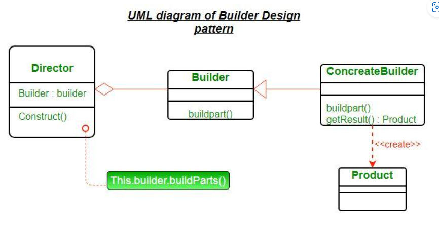

# Builder Pattern
- Là một mẫu dùng thuộc lớp creational, dùng để tạo ra một đối tượng có nhều thuộc tính hoặc phương thức phức tạp.
- Ví dụ khi ta cần khởi tạo một class Student, sẽ có nhiều thuộc tính ta cần phải thêm như id, name, phone, birthday, class...
- Nếu ta chỉ muốn khởi tạo với một số giá trị mà không phải truyền tất cả, ta có thể thêm giá trị null vào constructor khi khởi tạo
- hoặc tạo ra nhiều constructor với các attribute truyền vào khác nhau. Điều đó dẫn đến phức tạp khi thiết kế class
- Do vậy lớp builder sinh ra nhằm quản lý và cho phép tạo ra một đối tượng với các thuộc tính đặc biệt riêng dễ dàng hơn

- Product đại diện cho đối tượng cần tạo
- Builder là một abstract class hoặc interface chứa các phương thức khi tạo đối tượng
- ConcreteBuilder là một class thực thi các phương thức của lớp Builder, nó sẽ dùng để cụ thể hóa việc cài đặt của đối tượng trong class Builder
- Director là nơi thực thi tạo ra lớp Builder

