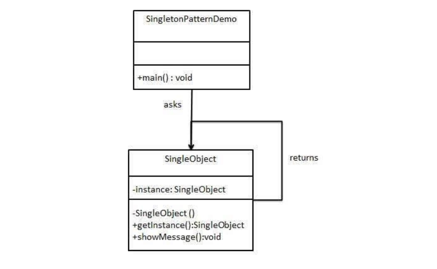

# Singleton design pattern
- Là mẫu thiết kế thuộc loại creational. Nó cho phép ta đảm bảo một lớp chỉ có duy nhất một thể hiện.
- Thường được sử dụng cho các đối tượng được sử dụng xuyên suốt toàn bộ chương trình, do đó mẫu thiết kế này cũng cung cấp một điểm truy cập toàn cục đến nó
# Cài đặt

# Các bước lưu ý
- Constructor của object phải set về private hoặc protected để quy định người dùng ko thể khởi tạo đối tượng bằng từ khóa "new"
vì sẽ dẫn đến khả năng tạo ra nhiều thể hiện khác nhau của một class
  - VD: 
    Object object1 = new Object(); 
    Object object2 = new Object();
  - object1 != object2
    Object object1 = Object.getInstance();
    Object object2 = Object.getInstance();
  - object1 = object2
# Các trường hợp thuường sử dụng
- Mẫu Abstract Factory => dùng để khởi tạo 1 thể hiện duy nhất của factory
- Mẫu Builder ...
- Mẫu Prototype ...
- Vd java.lang.Runtime() là lớp Singleton, để lấy được đối tượng duy nhất của nó, ta gọi phương thức getRuntime();...